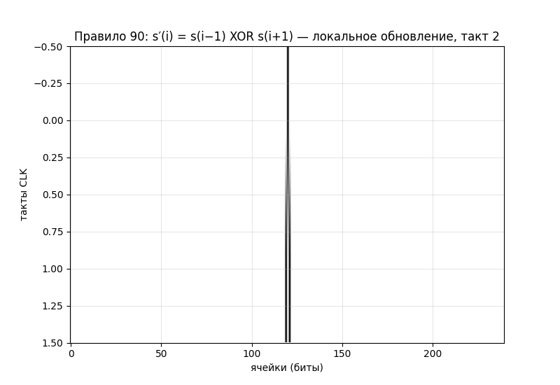
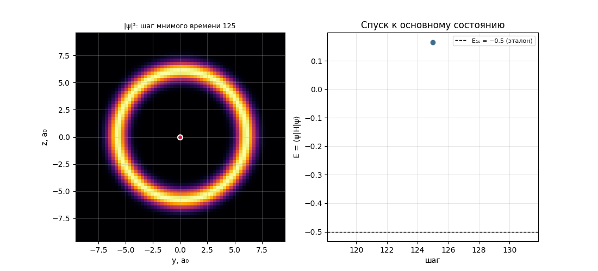
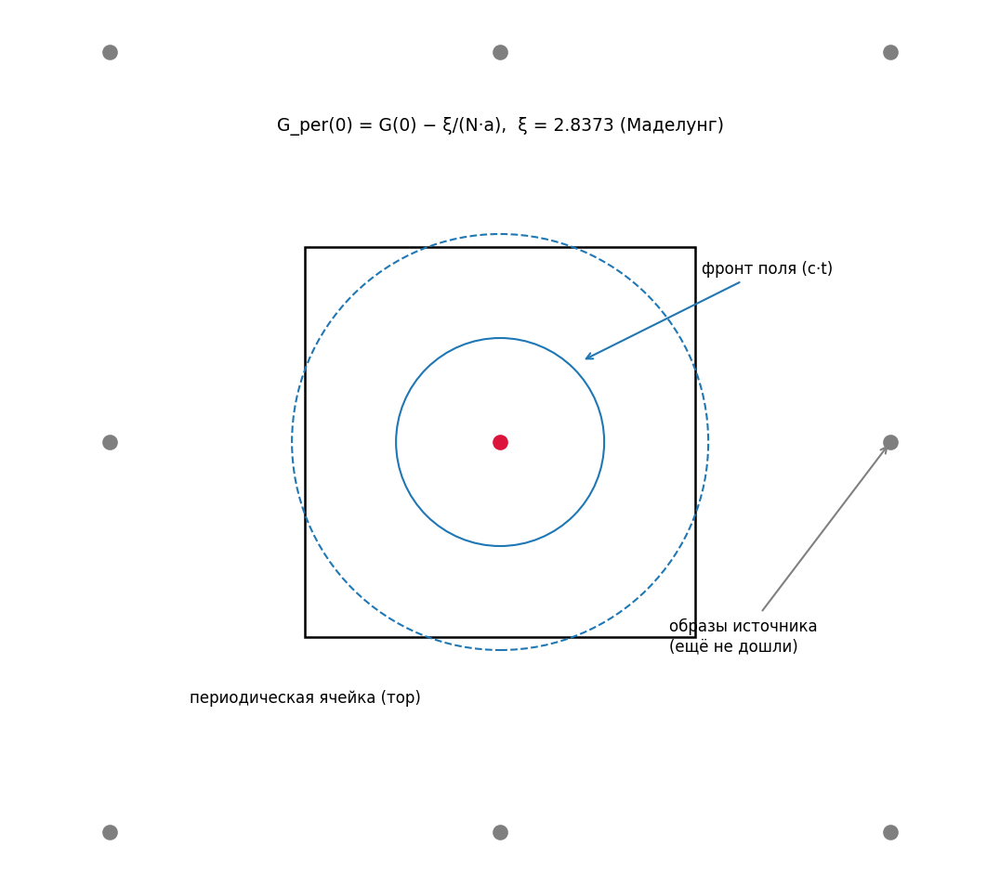
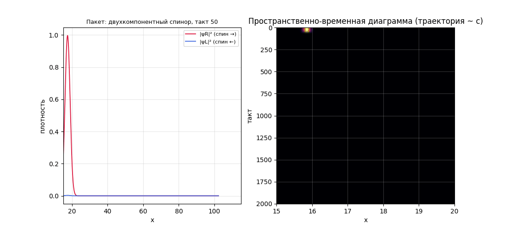
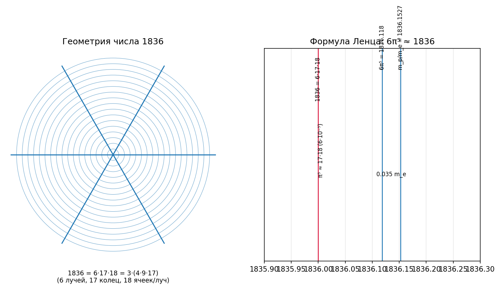
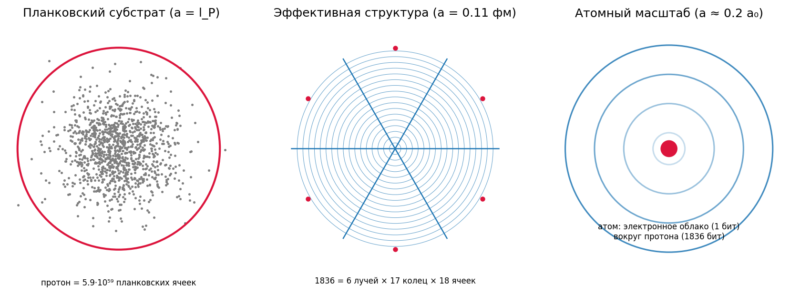

# Словарь понятий и визуальный гид

## (отдельный раздел исследования — «небытовые» термины простыми словами)

Все понятия исследования объяснены в трёх слоях: **(1) бытовая аналогия**,
**(2) точный смысл в исследовании**, **(3) анимация/схема**. Анимации
сгенерированы кодом (`scripts/run_glossary.py`, `results/glossary/`).

---

## Группа А. Основа вычислительной Вселенной

### Бит
**(1)** Как буква алфавита: минимальная «единица различия» — да/нет, 0/1.
**(2)** Элементарная частица Вселенной по гипотезе; масса частицы ~ число её
структурных битов. Ячейки решётки хранят амплитуды как B-битные слова
(fixed-point).
**(3)** см. анимацию клеточного автомата ниже.

### Клеточный автомат (КА)
**(1)** Как «Жизнь» Конвея или стая на клетчатой бумаге: много клеток, у каждой
простое правило, зависящее только от соседей; вся сложность — из миллиардов
одновременных шагов.
**(2)** Форма «Вселенского вычислителя»: решётка ячеек + локальные правила.
В исследовании это правила поля (Пуассон), амплитуд (мнимое время) и материи
(шахматная доска).



### CLK — тактовый генератор
**(1)** Как метроном: все клетки обновляются одновременно, «тик» за «тиком».
**(2)** Глобальное дискретное время Вселенной; такт τ = a/(√3·c) (условие
Куранта, раздел 1.5 отчёта №2). Период биений атома = 8457 тактов; фронт поля
проходит 1 ячейку за √3 такта.

### Локальность
**(1)** Правило «знай только соседей»: клетка не может заглянуть в другой конец
мира мгновенно.
**(2)** Ограничение на прошивку: информация движется ≤ 1 ячейки/такт = c —
это и есть причинность и световой конус (см. Группу В).

### Унитарность
**(1)** Как идеальная бухгалтерия: ничего не теряется и не «размножается» из
ничего — сумма вероятностей всегда 1.
**(2)** Свойство правила материи: норма волновой функции сохраняется (проверено:
0.0), т.е. вычислитель не создаёт и не уничтожает информацию.

---

## Группа Б. Квантовая механика на решётке

### Волновая функция (амплитуда ψ)
**(1)** Как «облако вероятности»: не говорит, где частица, а с какой
вероятностью она обнаружится в каждом месте (|ψ|²).
**(2)** Содержимое ячеек модели: комплексное число на ячейку (B бит).
Электрон = облако амплитуд вокруг протона; 1s, 2s, 2p — формы облаков.

### Суперпозиция
**(1)** Как аккорд: несколько нот звучат одновременно; частица «звучит»
несколькими состояниями сразу.
**(2)** Основа всех осцилляций исследования: 1s+2p_z даёт дипольные биения,
три массовые моды нейтрино — осцилляции аромата.

### Мнимое время
**(1)** Трюк, как «остудить» облако: замена времени t → −iβ превращает
осцилляции в затухание — всё лишнее вымирает, остаётся самое низкое по энергии
состояние (основное).
**(2)** Рабочий инструмент поиска 1s/2s/2p состояний; это в точности локальное
правило КА (6 соседей + поле + нормировка).



### Гамильтониан H и собственные состояния
**(1)** Гамильтониан — «счётчик энергии» системы; его собственные состояния —
те формы облака, которые не меняют форму со временем (только крутят фазу).
**(2)** H = −½∇² − 1/r на решётке; 1s, 2s, 2p_z — его собственные состояния;
их энергии Eₙ = −1/(2n²) — спектр атома.

### Квантовые биения
**(1)** Как биение двух камертонов: суперпозиция двух состояний с разными
энергиями «мигает» с частотой разности энергий.
**(2)** 1s+2s мигает с ΔE = 10.2 эВ (Lyman-α); диполь 1s+2p_z излучает на той
же частоте (см. анимацию атома в Группе Е).

### Импульсное представление и БПФ
**(1)** Как нотная запись вместо звуковой волны: то же облако, но описанное
«нотами» (волнами разных длин) вместо точек пространства.
**(2)** Быстрое преобразование Фурье переводит ψ(x) → φ(p); профиль 1s
совпадает с аналитикой (8/π²)(1+p²)⁻⁴ (рис. b5 основного отчёта); БПФ же
применяет кинетический шаг в вещественном времени.

### Расщепление Троттера
**(1)** Как разбить сложный танец на два простых шага, повторяемых быстро:
«полшага вправо, шаг влево, полшага вправо» ≈ один плавный шаг.
**(2)** Унитарный пропагатор e^(−iHτ) ≈ e^(−iVτ/2)·e^(−iTτ)·e^(−iVτ/2) —
использован в биениях и в вещественном времени.

---

## Группа В. Поля

### Поле
**(1)** Как температура в комнате: число в каждой точке пространства, создаваемое
источником и «ощущаемое» другими объектами.
**(2)** Данные в ячейках, записываемые протоном по локальному правилу; без поля
связанных состояний нет (проверено). Статическое поле протона = −1/r.

### Дискретный лапласиан
**(1)** «Сравни с соседями»: насколько значение в клетке отличается от среднего
по шести соседям — мера «кривизны» на решётке.
**(2)** Кинетический оператор T = −½L_d; его дисперсия E(k) = (2/a²)Σsin²(ka/2).

### Функция Грина решётки
**(1)** «Отпечаток» единичного источника: форма поля, если в одну клетку
положить единичный заряд.
**(2)** G(x) → 1/r (закон Кулона), а в узле источника G(0) = 2πW/a = 3.1759/a —
решётка сама «обрезает» бесконечность 1/r.

### Световой конус
**(1)** Граница того, что «успело долететь»: круг на воде от брошенного камня —
внутри круга волна есть, снаружи — нет.
**(2)** Фронт поля протона движется ровно со скоростью c = 1 ячейка/(√3 такта)
(измерено: наклон 0.5543 против 1/√3 = 0.5774).

### Условие Куранта
**(1)** Правило съёмки быстрого движения: кадр должен быть короче, чем время
пролёта одной клетки, иначе симуляция «взрывается».
**(2)** 7-точечное волновое правило устойчиво только при τ ≤ a/(√3c) — честная
находка: такт CLK привязан к самому жёсткому правилу.

### Принцип Гюйгенса
**(1)** Волна в 3D проходит и «не оставляет следа»: после прохождения фронта
остаётся только спокойная статика (в отличие от кругов на воде, которые
долго звенят).
**(2)** За фронтом поля устанавливается ровно −1/r (проверено: 6.4% на r = 5..10)
— так «вычислительная Вселенная» получает закон Кулона.


### Тор и постоянная Маделунга
**(1)** Игровое поле «Пакман»: уйдя за правый край, выходишь слева — края
склеены. На таком поле у каждого заряда есть «призраки»-образы.
**(2)** Расчётная сетка периодична; образы источника сдвигают поле на
ξ/(N·a), ξ = 2.8373 — постоянная Маделунга простой кубической решётки
(измерена согласованно на сетках 96 и 128).



---

## Группа Г. Материя, спин и релятивизм

### Шахматная доска Фейнмана (квантовая прогулка)
**(1)** Частица как пешка, которая каждый ход либо идёт прямо, либо
разворачивается (с маленькой амплитудой разворота = масса). Два шага —
«монета» (поворот спина) и «сдвиг» (шаг в свою сторону).
**(2)** Правило материи исследования: унитарно, локально; в пределе даёт
уравнение Дирака, при малых импульсах — Шрёдингера.



### Спин-½
**(1)** Внутренний «волчок» частицы с двумя положениями (↑/↓); у фермионов
пол-оборота меняет знак волновой функции.
**(2)** В модели спин — не постулат, а следствие двухшагового правила
(монета+сдвиг); проверка: спин-½ протона + спин-½ нейтрона дают спин-1
дейтрона с 4% d-волны (Группа Е).

### Zitterbewegung
**(1)** «Дрожание»: релятивистская частица на малых масштабах осциллирует
вокруг своей траектории с частотой 2mc²/ħ.
**(2)** Воспроизведено численно: скорость пакета осциллирует с ω = 2.03 ≈ 2m
(рис. ext2).

### Дисперсия ω(k)
**(1)** «Цена» волны: как частота колебаний зависит от длины волны — паспорт
любой среды (у воды, света и электронов — разные паспорта).
**(2)** Паспорт правила: ω = √(m²+k²) (Дирак) → m + k²/2m (Шрёдингер);
проверено с точностью 10⁻³ (рис. ext1).

### Комптоновская длина волны λ̄ = ħ/mc
**(1)** Естественный «размер» частицы: масштаб, на котором её масса становится
заметной (для электрона — 3.9·10⁻¹³ м, для протона — в 1836 раз меньше).
**(2)** Ключевая находка исследования: радиус протона r_p = 4λ̄_p с точностью
0.02%; эффективная ячейка структуры a_eff = λ̄_p/2 = 0.11 фм.

---

## Группа Д. Частицы и числа

### Масса ~ информация
**(1)** «Сколько весит файл»: масса частицы = объём её «структурного файла»
(битов), энергия E = mc² — цена хранения.
**(2)** m_p/m_e = 1836.15 = I_p/I_e; бит массы (вариант B) m_e/1836 = 278.3 эВ;
связи — малые поправки (13.6 эВ у атома, 2.22 МэВ у дейтрона).

### 6π⁵ (формула Ленца)
**(1)** Числовая загадка: отношение масс протона и электрона почти равно
6π⁵ = 1836.118 (отклонение 0.002%) — «π в пятой степени» у протона.
**(2)** Углубление исследования: π⁵ = 306.02 ≈ 17·18 = 306 (точность 6·10⁻⁵),
а 6·17·18 = 1836 — точное целое: геометрия «6 лучей × 17 колец × 18 ячеек»;
17 — простое Ферма; остаток 0.035 m_e — кандидат в «биты связи».



### Планковская длина l_P
**(1)** Самый мелкий «пиксель» природы (1.6·10⁻³⁵ м), ниже которого наши
понятия пространства перестают работать.
**(2)** Нижний этаж двухмасштабной картины: протон занимает 5.9·10⁵⁹
планковских ячеек; на каждый структурный бит — 3.2·10⁵⁶ ячеек «прошивки».

### Два масштаба (7.6 ячеек vs 10⁵⁹)
**(1)** Как пиксель и буква: одна «буква» (бит) набрана из огромного числа
«пикселей» (планковских ячеек) — избыточность прошивки.
**(2)** 7.6 ячеек — эффективный размер протона в ячейках a_eff = 0.11 фм;
планковский субстрат того же протона — 5.9·10⁵⁹ ячеек; иерархия
a_P ≪ a_QCD ≪ a_atom.



### Кварки (конституентные)
**(1)** «Кирпичики» протона: 3 кварка, несущие дробные заряды 2/3, 2/3, −1/3.
**(2)** В модели: 3 кварка × 612 бит (612 = 4·9·17 = 2²·3²·17) + 0.1527 бита
связи (78 кэВ); 1836 = 3·4·9·17.

---

## Группа Е. Атом и ядро

### Вириальная теорема
**(1)** Для систем с законом 1/r: кинетическая энергия ровно вдвое меньше
потенциальной по модулю — «бюджет» атома.
**(2)** ⟨T⟩ = −Eₙ, ⟨V⟩ = 2Eₙ — проверено для 1s, 2s, 2p (основной отчёт).

### Lyman-α
**(1)** Самая энергичная линия водорода: прыжок электрона 2→1 (ультрафиолет,
121.6 нм).
**(2)** Частота биений и дипольных осцилляций исследования: ΔE = 0.375 хартри
(модель при a = 0.26 даёт 0.3954 — ошибка дискретизации).


### Ларморова мощность и время жизни
**(1)** Колеблющийся заряд излучает, теряет энергию и затухает, как камертон.
**(2)** Оценка времени жизни диполя 1s+2p: τ ≈ 3.0 нс против измеренного
1.6 нс — порядок совпадает; за период анимации затухание невидимо
(τ/T ≈ 8·10⁶).

### Магнитный момент и d-волна дейтрона
**(1)** «Сила магнитика» частицы; если у системы из двух спинов момент чуть
меньше суммы — значит, они не только в S-состоянии, но и в D-состоянии
(деформированы).
**(2)** Из μ_d = 0.8574 и μ_p + μ_n = 0.8798 извлечено P_D = 3.9% d-волны;
квадруполь Q_d = 0.286 фм² подтверждает деформацию — проверка спиновой
структуры протона.

### Нуклеосинтез: закалка, бутылочное горлышко, Y_p
**(1)** Первые минуты Вселенной: (а) «закалка» — реакции обмена протон↔нейтрон
выключаются, их отношение застывает 1/5; (б) «бутылочное горлышко» — дейтерий
не выживает, пока горячо: фотоны разбивают его, всё ждёт до T ≈ 0.06 МэВ;
(в) Y_p ≈ 0.25 — доля гелия.
**(2)** Вся цепочка вычислена из масс паттернов: n/p = e^(−1.293/0.8) = 0.199,
T_D = 0.062 МэВ (итерации), Y_p ≈ 0.27 (наблюдаемое 0.247), D/H = 2.5·10⁻⁵
(рис. ext4).

---

## Группа Ж. Нейтрино

### Ароматы и PMNS-матрица
**(1)** У нейтрино три «вкуса» (e, μ, τ); каждый вкус — коктейль из трёх
«сортов массы» (ν₁, ν₂, ν₃), рецепт коктейля — матрица PMNS.
**(2)** В модели: аромат = поворот трёх массовых мод минимального паттерна;
матрица построена из реальных углов (33.4°, 49.1°, 8.6°, δ = 195°).

### Осцилляции нейтрино
**(1)** Нейтрино в полёте периодически «меняет вкус», как маятник,
перекачивающий энергию между тремя модами.
**(2)** P(ν_e→ν_α) = |Σ U_αi U*_ei e^(−iω_i t)|² — чистая интерференция фаз
трёх каналов квантовой прогулки; совпадение с аналитикой 0.3%.

### Декогеренция
**(1)** Размывание интерференции: как два певца, разошедшиеся по сцене, —
перестают звучать в унисон.
**(2)** В модели — буквальное разделение массовых мод на решётке (разные
групповые скорости): амплитуда осцилляций падает, L_coh = 2891 ячейка.


---

## Группа З. Термодинамика информации

### Ландауэр: стирание бита стоит kT·ln 2
**(1)** Удалить информацию «бесплатно» нельзя: корзина на компьютере выделяет
тепло — минимальная цена стирания одного бита.
**(2)** Основа связи вычислений и тепла — мост к гравитации (раздел 5.2
основного отчёта).

### Марголус–Левитин: темп вычислений ≤ 2E/πħ
**(1)** Компьютер не может считать быстрее, чем позволяет его энергия: есть
предельная скорость обработки битов на джоуль.
**(2)** Ограничивает темп тактов CLK «Вселенского вычислителя» полной
энергией-массой мира.

### Бекенштейн–Хокинг: энтропия чёрной дыры = A/4l_P²
**(1)** Чёрная дыра — «самый плотный жёсткий диск»: её информационная ёмкость
пропорциональна площади горизонта, один бит на ~4 планковские площадки.
**(2)** Предел плотности информации, с которым согласуется решётка при
a ~ l_P: чёрная дыра = максимально плотный паттерн (раздел 5.2).

### Энтропийная гравитация (Якобсон, Верлинде)
**(1)** Тяготение как «статистика толпы»: из термодинамики информации на
горизонте получаются уравнения Эйнштейна — гравитация не отдельная сила,
а термодинамика вычислителя.
**(2)** Вход №1 для гравитации в модели (раздел 5.2 основного отчёта); дискретная
динамика — исчисление Редже/причинные триангуляции — открытая задача.

---

## Как воспроизвести

```
python scripts/run_glossary.py    # анимации и схемы этого словаря (~2 минуты)
python scripts/run_extensions.py  # основные эксперименты и анимации (~8 минут)
python scripts/run_model.py       # вычислительная модель (~20 минут)
python scripts/run_baseline.py    # эталон (~10 минут)
```
