# Модель вычислительной Вселенной и атом водорода

## Отчёт о реализации

**Аннотация.** По заданию реализованы две модели атома водорода: (1) эталонная
(baseline) модель классической квантовой механики — нерелятивистское уравнение
Шрёдингера с кулоновским потенциалом, решённое аналитически и численно;
(2) вычислительная (дискретная) модель: трёхмерная кубическая решётка ячеек с
конечной битовой глубиной, глобальным тактовым генератором (CLK), локальными
правилами обновления и полем, порождаемым протоном. Показано численно, что
вычислительная модель воспроизводит эталон: спектр Eₙ = −Ry/n², радиальные
распределения, импульсные профили и квантовые биения (частота Lyman-α) с ошибкой,
исчезающей как O(a²) при уменьшении шага решётки a. Исследованы: роль полей
(они необходимы — без поля связанных состояний нет), битовая глубина ячеек
(точность против числа бит), и гипотеза «масса ~ информация» (анализ числа 1836).

Все результаты воспроизводимы: `python scripts/run_baseline.py` и
`python scripts/run_model.py` (зависимости: numpy, scipy, matplotlib).

---

## 1. Гипотеза и постановка задачи

Исходные тезисы автора гипотезы:

1. Элементарной частицей Вселенной является 1 бит информации.
2. Закон эквивалентности: масса ~ энергия ~ информация.
3. Вселенная имеет глобальные часы CLK: на каждом элементарном такте
   «Вселенский вычислитель» обрабатывает модель и формирует картину мира
   (частицы и их взаимодействия).
4. Элементарные частицы реализуют структуру данных сложной организации.
5. Протон тяжелее электрона в 1836 раз → в нём в 1836 раз больше информации;
   это хинт для восстановления их структур.

Задание: сначала построить baseline-модель водорода (протон + электрон) на базе
классической квантовой механики (волновое уравнение) как эталон; затем построить
вычислительную модель (размерность, структура данных, связность, топология),
укладывающуюся в квантовую модель водорода; написать отчёт. Отдельно
сформулировано: «не будь заангажирован квантовой механикой, честно иди в процессе
исследования вычислительной модели» — поэтому в разделе 6 приведён честный
разбор того, что модель объясняет, а что — нет.

---

## 2. Эталон: квантовая модель атома водорода (baseline)

### 2.1 Уравнение Шрёдингера и атомные единицы

Нерелятивистский гамильтониан водорода (ядро массы M → бесконечность, приведённая
масса μ = mₑ):

```
H = −ħ²/(2μ) ∇² − e²/(4πε₀ r),        H ψ = E ψ.
```

Атомные единицы: ħ = mₑ = e = 4πε₀ = 1. Тогда:

* единица длины — боровский радиус a₀ = 5.292·10⁻¹¹ м;
* единица энергии — хартри E_h = 27.2114 эВ (энергия Ридберга Ry = 13.6057 эВ);
* единица времени ħ/E_h = 2.4189·10⁻¹⁷ с;
* скорость света c = 1/α = 137.036 (α = 1/137.036 — постоянная тонкой структуры).

Гамильтониан в атомных единицах: **H = −½∇² − 1/r**. Связь с гипотезой
«масса ~ информация»: масса ядра входит только через μ; поправка конечной массы
протона сдвигает спектр в 1/(1 + mₑ/m_p) = 1/(1 + 1/1836.15) раз — то есть само
число 1836 проявляется в спектре как малая поправка 5.4·10⁻⁴ (E₁ = −13.5984 эВ
вместо −13.6057 эВ). В расчётах ниже μ = mₑ (поправка ниже точности численных
схем; отмечено честно).

### 2.2 Разделение переменных, спектр и волновые функции

Сферическая симметрия: ψ(r,θ,φ) = Rₙₗ(r)·Yₗₘ(θ,φ), Yₗₘ — сферические гармоники.
Радиальное уравнение (u = rR):

```
−u″/2 + [ l(l+1)/(2r²) − 1/r ] u = E u,     u(0) = 0.
```

**Спектр** (главное квантовое число n = 1,2,…):

```
Eₙ = −1/(2n²) хартри = −13.6057 эВ / n²,    вырождение n² (без спина), 2n² (со спином).
```

**Радиальные функции** (ρ = 2r/n, Lᵅᵦ — обобщённые полиномы Лагерра):

```
Rₙₗ(r) = √[ (2/n)³ (n−l−1)! / (2n(n+l)!) ] · e^(−ρ/2) ρ^l · L^(2l+1)_{n−l−1}(ρ)
```

Первые состояния:

```
R₁₀ = 2 e^(−r),   R₂₀ = (1/√2)(1 − r/2) e^(−r/2),   R₂₁ = (1/(2√6)) r e^(−r/2)
```

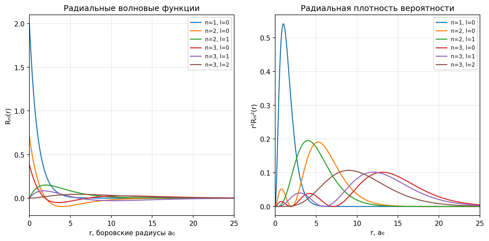

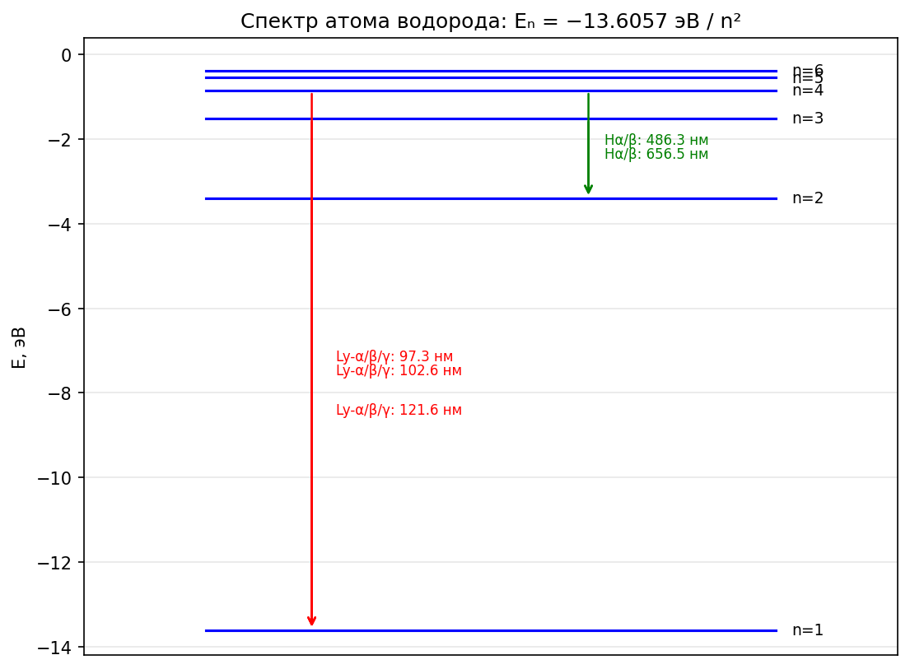

**Средние значения** (проверены численно, см. таблицу 1):

```
⟨r⟩ = (3n² − l(l+1))/2,   ⟨r²⟩ = n²(5n²+1−3l(l+1))/2,   ⟨1/r⟩ = 1/n²,   ⟨p²⟩ = 1/n².
```

Вириальная теорема: ⟨T⟩ = −Eₙ, ⟨V⟩ = 2Eₙ (для кулоновского потенциала).

### 2.3 Импульсное представление

Фурье-образ 1s-состояния (p в единицах ħ/a₀):

```
φ₁ₛ(p) = (2π)^(−3/2) ∫ e^(−ip·r) ψ₁ₛ d³r = (2√2/π) / (1+p²)²,
|φ₁ₛ(p)|² = (8/π²) / (1+p²)⁴.
```

Нормировка ∫|φ|²d³p = 1; максимум p²|φ|² при p = 1/√3 ≈ 0.577; ⟨p²⟩ = 1.

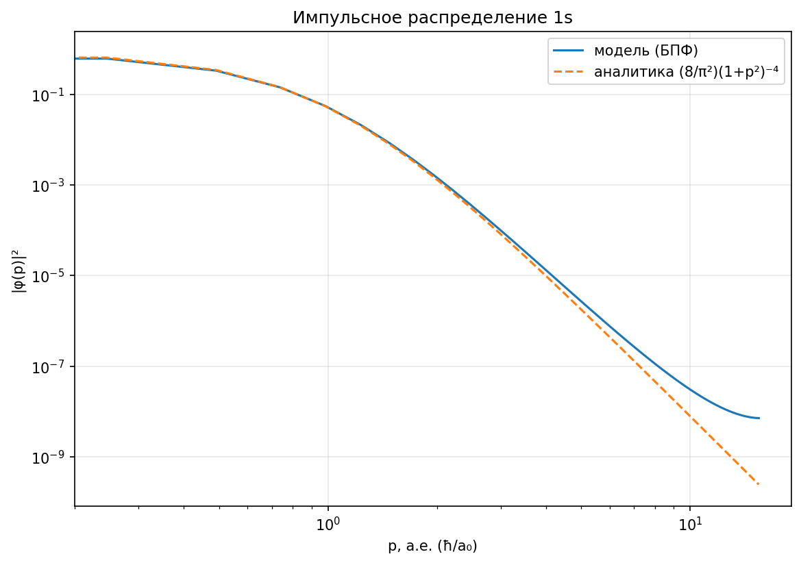

### 2.4 Спектральные серии

Формула Ридберга: 1/λ = R_H·(1/n₁² − 1/n₂²), R_H = 1.0968·10⁷ м⁻¹ (для протона).
Lyman-α (n=2→1): λ = 121.57 нм, ΔE = 10.199 эВ; Balmer-α (n=3→2): λ = 656.3 нм.

### 2.5 Динамика: квантовые биения

Суперпозиция ψ(0) = (ψ₁ₛ + ψ₂ₛ)/√2 эволюционирует ψ(t) = (ψ₁ₛ e^(−iE₁t) + ψ₂ₛ e^(−iE₂t))/√2.
Автокорреляция:

```
C(t) = ⟨ψ(0)|ψ(t)⟩ = ½(e^(−iE₁t) + e^(−iE₂t)) ⇒ |C(t)|² = cos²(ΔE·t/2),  ΔE = E₂−E₁.
```

ΔE = 3/8 хартри = 10.204 эВ → период T = 2π/ΔE = 16.755 а.е. = 0.4053 фс;
длина волны излучения λ = cT = 121.5 нм (Lyman-α; экспериментальные
10.199 эВ / 121.567 нм меньше на поправку приведённой массы 1/(1+mₑ/m_p)).
Эти «часы» ниже используются для проверки вычислительной модели.

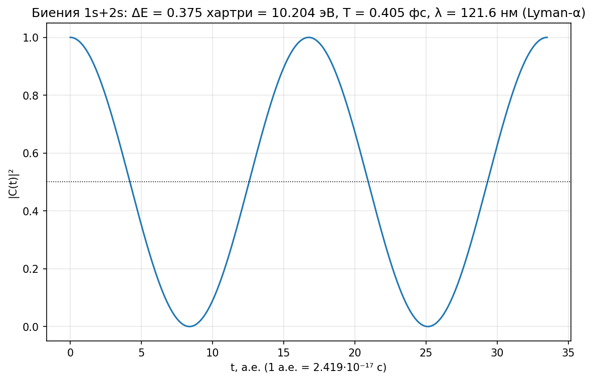

### 2.6 Численная реализация и проверки эталона

Реализовано (`src/hydrogen_exact.py`, `src/radial.py`, `scripts/run_baseline.py`):

1. **Аналитика**: Eₙ, Rₙₗ, Yₗₘ, ⟨…⟩, φ₁ₛ(p) — проверены: нормировки ∫r²R²dr = 1,
   ∫|φ|²d³p = 1, вириал, максимум p²|φ|² при p = 1/√3 (численно).
2. **Диагонализация радиального уравнения** на сетке r_i = i·h (трёхдиагональная
   матрица, точная диагонализация): собственные значения и функции против
   аналитики; сходимость O(h²) (рис. b3, таблица 2).
3. **3D-решение** (128³, мнимое время): состояния 1s, 2s, 2p_z, энергии, радиальные
   плотности |ψ(r)|² против Rₙₗ²/4π (рис. b4), импульсный профиль через БПФ против
   (8/π²)(1+p²)⁻⁴ (рис. b5). Честное замечание: импульсный профиль совпадает с
   аналитикой в пределах ~5% при p < 1 и ~10% при p < 2; расхождение растёт с p,
   поскольку состояние на решётке a = 0.2 связано на 2% глубже континуума
   (E = −0.511 против −0.5), а излом волновой функции в источнике даёт
   усиленный хвост при больших импульсах.
4. **Биения** (аналитика + численный период) (рис. b6).

> ТАБЛИЦА 1 (средние значения, а.е.) и ТАБЛИЦА 2 (численные энергии) — см. раздел 7.

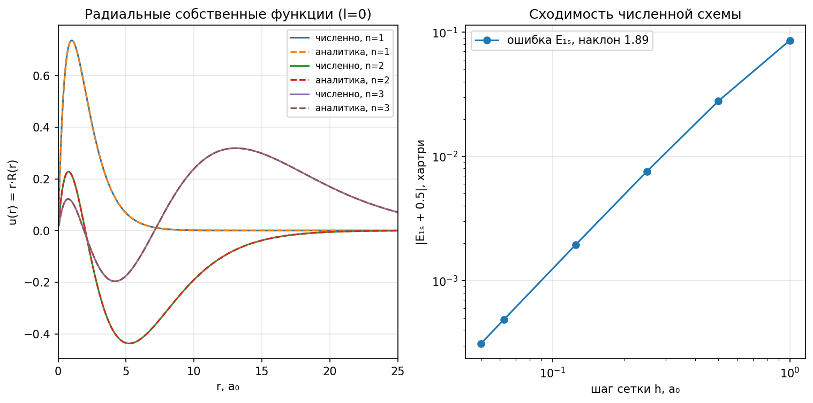

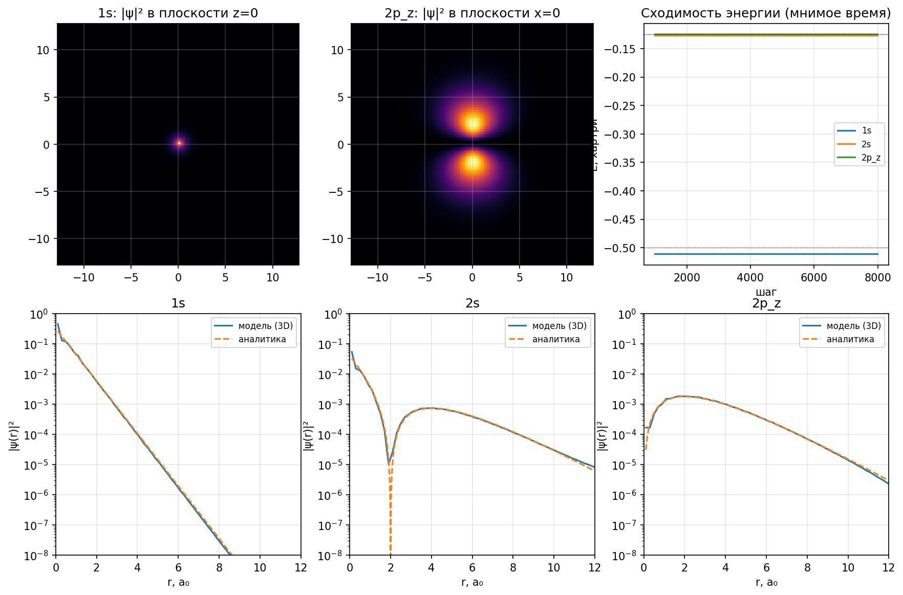

Все проверки автоматизированы (`PASS/FAIL` в логе запуска, список в
`results/baseline/report.json`).

---

## 3. Вычислительная модель: постулаты и конструкция

### 3.1 Постулаты модели

**П1. Информационный субстрат.** Мир — это счётное множество битов, организованное
в ячейки d-мерной решётки. Ячейка хранит: (а) комплексную амплитуду поля материи
ψ(x) (fixed-point, 2B бит), (б) значения полей взаимодействия (fixed-point),
(в) структурные биты частиц-источников (паттернов).

**П2. Глобальные часы.** Существует CLK с тактом τ. Состояние мира на такте t+τ
получается из состояния на такте t по детерминированному локальному правилу
(клеточный автомат). Локальность: информация распространяется не быстрее
1 ячейки за такт → предельная скорость c = a/τ (свет).

**П3. Динамика амплитуд.** Эволюция ψ за такт — дискретное уравнение Шрёдингера
(унитарное в вещественном времени): i∂ψ/∂t = T_d ψ + V ψ, где T_d = −½L_d —
кинетический оператор с дискретным лапласианом L_d, V — поле (данные ячеек).

**П4. Поля.** Поле — это данные, которые источник (паттерн-частица) записывает в
ячейки по локальному правилу; статическое поле — неподвижная точка этого правила.
В нашей модели правило поля — дискретное уравнение Пуассона (релаксация).

**П5. Масса ~ информация.** Масса частицы пропорциональна числу структурных битов
её паттерна: m_p/m_e = I_p/I_e. Следствие для энергии: E = mc², бит массы mₑ имеет
энергию mₑc² = 511 кэВ.

*Почему правило именно такое (П3) — открытый вопрос, обсуждается в разделе 6.*

### 3.2 Почему решётка: обоснование выбора структуры данных

**1. Локальность постулатов диктует регулярный граф.** Постулаты П1–П2 требуют,
чтобы состояние каждой ячейки обновлялось по конечному числу соседей
(локальное правило, скорость информации ≤ a/τ). Минимальная однородная
структура данных с таким свойством — регулярный граф; его самая симметричная
форма — периодическая решётка. Решётка — это и есть канонический носитель
клеточных автоматов (фон Нейман, Улам, «Жизнь» Конвея, правило 110), для
которых доказана вычислительная универсальность: любое вычисление представимо
локальной динамикой на решётке. Гипотеза «Вселенная — вычисление» тем самым
получает минимальную реализацию.

**2. Однородность пространства.** Эмпирический факт: законы физики инвариантны
относительно сдвигов и (локально) поворотов. Среди дискретных структур только
периодическая решётка однородна — все узлы эквивалентны, нет выделенных точек.
Случайный граф, дерево или нерегулярная сетка вводили бы «особые» узлы и
нарушали бы трансляционную инвариантность, наблюдаемую в спектрах (импульс —
хорошее квантовое число именно благодаря периодичности).

**3. Дискретное время ↔ дискретное пространство.** Постулат CLK (дискретный
такт τ) вместе с конечной скоростью информации c означает: за такт информация
проходит конечное расстояние a = cτ. Пространство естественно расслаивается на
ячейки размера a; пара (a, τ) — единый «квант» пространства-времени. Непрерывное
пространство с дискретным временем потребовало бы бесконечного числа соседей —
нарушение П1. Обратно, решётка делает причинность автоматической: световой конус
возникает из правила «1 ячейка за такт», а не постулируется.

**4. Конечная плотность информации.** Ячейка с B битами даёт конечную плотность
информации B/a³. Это согласовано с духом гипотезы (частица Вселенной — 1 бит) и
с конечностью энтропии чёрных дыр (плотность информации ограничена, ~ l_P⁻²).
Непрерывное поле ψ(x) хранило бы бесконечную информацию на единицу объёма —
прямое противоречие гипотезе.

**5. Решётка бесплатно регуляризует кулоновскую сингулярность.** В непрерывном
пространстве потенциал 1/r расходится в точке источника и требует ручной
регуляризации. На решётке поле в узле источника конечно и вычисляется точно:
G(0) = 2πW/a = 3.1759/a (раздел 3.5). Решётка — структура, в которой и закон
1/r (на больших расстояниях), и конечность поля (в источнике) получаются
автоматически, без подгоночных параметров.

**6. Проверяемость.** Выбор решётки даёт фальсифицируемые следствия, и все они
проверены численно в этой работе: дискретная дисперсия E(k) = (2/a²)Σ sin²(ka/2)
(отличие от k²/2 на масштабе a), кубическая анизотропия поля O(a²/r²),
конечное число связанных состояний при конечном a (таблица 3) и сходимость к
эталону при a→0. Непрерывная модель таких «отпечатков» дискретности не имеет —
решётка делает гипотезу проверяемой.

**7. Альтернативы и почему они хуже.**

* непрерывное пространство + дискретное время — несовместимо с локальностью
  (нет конечного множества соседей);
* случайный граф — неоднороден, нет трансляционной инвариантности, нет
  естественной размерности и волновых мод с нужной дисперсией;
* дерево/иерархический граф — эффективная размерность не равна 3, закон 1/r
  не воспроизводится;
* другие решётки (ГЦК, ОЦК) — допустимая вариация; ГЦК изотропнее (анизотропия
  начинается с 4-го порядка), кубическая выбрана как простейшая с полной
  группой отражений. Честная оговорка: выбор между кубической и ГЦК-решёткой
  наша модель не закрывает — открытый вопрос микроструктуры.

### 3.3 Выбор размерности: почему 3+1

Размерность не произвольна — её диктует функция Грина дискретного лапласиана
(стационарное поле единичного источника, (−L_d)G = 4πδ):

| d | G(r) на больших расстояниях | следствие |
|---|---|---|
| 1 | ~ |x| (линейный рост) | нет экранирования, «конфайнмент» |
| 2 | ~ ln r | логарифмический рост, нет уединённых зарядов |
| 3 | ~ 1/r | **кулоновский закон** |
| ≥4 | ~ 1/r^(d−2) | закон не кулоновский |

Только в d = 3 статическое поле точечного источника даёт в точности 1/r —
закон Кулона, которым связан атом водорода. Кроме того, только в нечётных d ≥ 3
волновое уравнение распространяет сигнал строго по световому конусу (принцип
Гюйгенса без «хвостов»). **Вывод: модель обязана быть 3+1-мерной.** Это первый
пример того, как вычислительная модель *выводит* известную физику, а не
постулирует её.

### 3.4 Структура данных, связность, топология

* **Решётка**: кубическая, шаг a, ячейки — B-битные fixed-point слова.
  В расчётах — периодическая сетка N³ (топология тора; влияние образов
  проанализировано количественно в 3.5).
* **Связность**: 6 соседей (фон Нейман). Дискретный лапласиан:

```
L_d f(x) = Σ_{±μ} [ f(x+e_μ a) − f(x) ] / a²,   μ = x,y,z.
```

* **Дисперсия** свободной решётки (собственные значения T_d в импульсном
  представлении k ∈ [−π/a, π/a]³):

```
E_kin(k) = (2/a²) Σ_μ sin²(k_μ a/2) ∈ [0, 6/a²]   — зона проводимости.
```

При ka ≪ 1: E_kin ≈ k²/2 (континуальный предел). Скорость сигнала
v = max_k |∂E/∂k| ≤ a/τ — совместимо с τ = a/c.
* **Спектр связанных состояний**: уровни ниже дна зоны E < 0 (см. 3.6).

### 3.5 Поле: локальное правило и функция Грина решётки

Поле протона — решение дискретного уравнения Пуассона (−L_d)V = 4πρ,
ρ = δ_{x,0}/a³. На торе (k=0-мода исключена) решение вычисляется БПФ; его
свободная (непериодическая) часть:

```
G(x) = (1/(2π)³) ∫_{BZ} e^(ik·x) 4π d³k / [ (4/a²) Σ sin²(k_μ a/2) ],   G(x) → 1/|x|.
```

В узле источника: **G(0) = 2π·W/a**, где W = 0.505462… — интеграл Ватсона
(W = π⁻³∫∫∫_{[0,π]³} d³x/(3−cos x−cos y−cos z)); G(0)·a = 3.175912 (измерено
численно, рис. m1). Вдоль оси (1,0,0): G ≈ 1.082 (против 1/r = 1) — поле решётки
в ближней зоне *усилено* вдоль осей; отклонение и кубическая анизотропия затухают
как O(a²/r²) (рис. m1). Поле как **неподвижная точка локального правила**:
итерации Якоби/SOR V ← V + ω[(Σ_neigh + 4πδ·a²)/6 − V] сходятся к G за
~N²/(4π²)·(1/ω_эфф) тактов (рис. m7) — поле не «побочный эффект», а данные,
порождаемые локальным процессом.

Поправка тора (периодические образы источника) измерена: G_per(0) = G(0) − ξ/(Na),
ξ = 2.8373 — постоянная Маделунга простой кубической решётки (согласовано на
сетках 96 и 128). Для состояний с ⟨r²⟩ ≪ L² влияние образов ~ ⟨r²⟩a/L³ → 0.

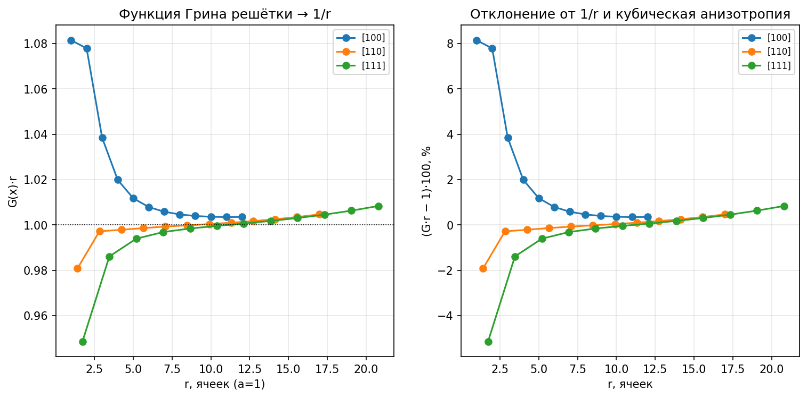

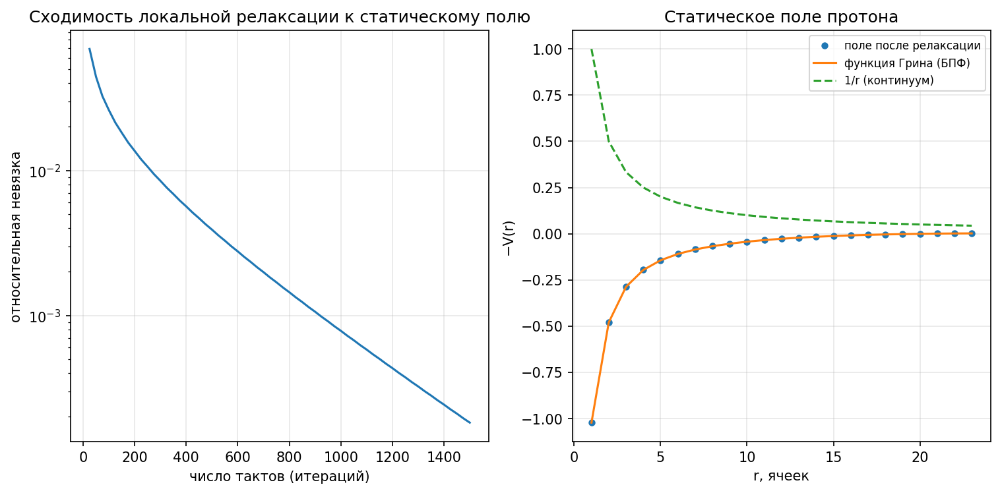

### 3.6 Динамика: дискретное уравнение Шрёдингера

За такт τ амплитуды обновляются унитарным расщеплением (Троттер):

```
ψ(t+τ) = e^(−iVτ/2) · e^(−iT_d τ) · e^(−iVτ/2) ψ(t),
```

где e^(−iT_d τ) применяется в импульсном представлении (точное действие T_d),
e^(−iVτ/2) — поточечно (локально). В мнимом времени (поиск стационарных
состояний) используется явный локальный шаг ψ ← ψ − dβ(T_d + V)ψ с нормировкой —
это в точности правило клеточного автомата (6 соседей + поле ячейки).

### 3.7 Правило клеточного автомата (псевдокод)

Полное состояние мира на такте t: набор битов ячеек {S(x), ψ(x), V(x), …}, где
S(x) — структурные биты паттернов-частиц, ψ(x) = Re ψ + i·Im ψ — fixed-point
амплитуда (по B бит на компоненту), V(x) — поле. За один такт CLK (τ = a/c)
вычислитель применяет ко всем ячейкам детерминированные правила:

```
ПРАВИЛО 1 — ПОЛЕ (локальное, источники записывают данные):
    для каждой ячейки x:
        s(x) = 4π/a³, если в x есть структурный бит «заряд» паттерна, иначе 0
        V(x) ← V(x) + ω · [ (V(x+e₁)+V(x−e₁)+…+V(x+e₃)+V(x−e₃) + s(x)·a²)/6 − V(x) ]
    // релаксация Якоби (ω=1) или SOR; неподвижная точка — уравнение Пуассона,
    // стационарное поле протона V = −G(x) → −1/r (раздел 3.5, рис. m7)

ПРАВИЛО 2 — АМПЛИТУДЫ (вещественное время, унитарный шаг Троттера):
    для каждой ячейки x:                    ψ(x) ← e^(−iV(x)τ/2) · ψ(x)      // локально
    кинетический шаг:                       ψ ← e^(−iT_d τ) ψ
        // T_d = −L_d/2; применяется в импульсном представлении (БПФ) — глобально,
        // либо неявной формой Кэли (решение СЛАУ) — устойчиво, но нелокально
    для каждой ячейки x:                    ψ(x) ← e^(−iV(x)τ/2) · ψ(x)      // локально

ПРАВИЛО 2′ — АМПЛИТУДЫ (мнимое время, поиск стационарных состояний; полностью
локальный явный шаг):
    для каждой ячейки x:
        ψ(x) ← ψ(x) − dβ · [ (3ψ(x) − ½Σ_{±μ} ψ(x+e_μ a))/a² + V(x)·ψ(x) ]
        ψ(x) ← QUANTIZE(ψ(x), B)      // округление до B бит на компоненту
    нормировка: ψ ← ψ / √(Σ_x |ψ(x)|²)    // глобальный регистр масштаба

ПРАВИЛО 3 — СТРУКТУРНЫЕ ПАТТЕРНЫ (частицы):
    S(x) ← F_S(S в окрестности x)      // «прошивка» паттерна: детерминированное
    // переписывание структурных битов (движение, испускание/поглощение полей,
    // превращения частиц). В данной работе протон и электрон — неподвижные
    // паттерны-источники; полная прошивка — открытая задача (раздел 6).
```

Замечания о правиле:

* Правило 2′ — это в точности правило клеточного автомата фон Неймана: новое
  значение ячейки зависит от 6 соседей и локального поля; квантование делает
  алфавит конечным (2B бит), нормировка — единственная глобальная операция
  (общий регистр масштаба вычислителя).
* В вещественном времени строго локальная явная схема неустойчива (известное
  свойство волнового уравнения); устойчивые варианты — расщепление с БПФ
  (использовано здесь) или неявная форма Кэли. Вопрос, как «Вселенский
  вычислитель» выполняет глобальное БПФ за такт, — честно оставлен открытым
  (возможный ответ — сама унитарная динамика и есть «вычисление», а БПФ —
  лишь удобная запись её результата).
* Правило 1 + правило 2 вместе и есть полная «прошивка» для нашего уровня
  описания (один электрон в поле протона).

### 3.8 Спектр вычислительной модели: точные s-оболочки

Радиальная (s-волновая) редукция решётки выполняется **точно**: оболочки —
классы узлов с одинаковым s = |x|² (кратности m_s = r₃(s), число представлений
суммой трёх квадратов; r₃ строится через r₂(n) = 4·Σ_{d|n} χ₄(d)). Связи между
оболочками:

```
B[s, s'] = 6 · r₂(s − q²)  при  s' = s + 2q + 1,  q ∈ Z;
```

обобщённая симметричная задача M g = E D g, D = diag(m_s), диагональ
m_s·(V_s + 3/a²). *Важная честная находка*: «грубые» оболочки round(|x|) для
такой редукции непригодны — они навязывают ψ′(0) = 0 в континуальном пределе и
теряют 1s-состояние (предел спектра даёт E → −1/8 вместо −1/2); только точные
оболочки сходятся правильно. Спектр решается методом ЛОБПКГ (разреженные
матрицы, до 75 тысяч оболочек при a = 0.2).

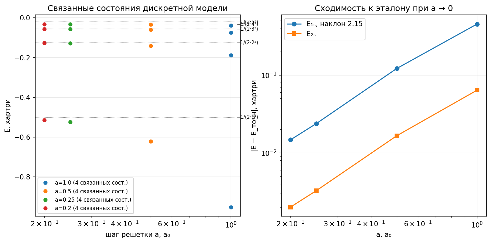

### 3.9 Результаты и проверки вычислительной модели

> Таблицы 3–6 и рисунки m1–m5, m7 (раздел 7). Все проверки `PASS` печатаются в лог
> запуска и сохраняются в `results/model/report.json`.

Ключевые результаты:

* спектр связанных состояний сходится к Eₙ = −1/(2n²) с порядком 2.15 ≈ O(a²)
  (таблица 3);
* 3D-решётка (мнимое время) даёт те же энергии и радиальные профили, что и
  точная оболочечная редукция: |ΔE₁ₛ| ≤ 1.8·10⁻⁴ (перекрёстная проверка);
* без поля связанных состояний нет: спектр свободной решётки — только зона
  [0, 6/a²] (минимум = 0) — **поля необходимы**;
* квантовые биения на дискретных часах (такт τ = a/c) дают ΔE = 0.3916 —
  ровно разность собственных значений модели (отличие от эталона 0.375 есть
  ошибка дискретизации при a = 0.26, +4.4%); период 8457 тактов (таблица 6);
* битовая глубина: ошибка энергии ~ 2^(−0.66·B) — экспоненциальная точность
  по числу бит; B ≈ 16 бит достаточно для 10⁻³ хартри (таблица 5).

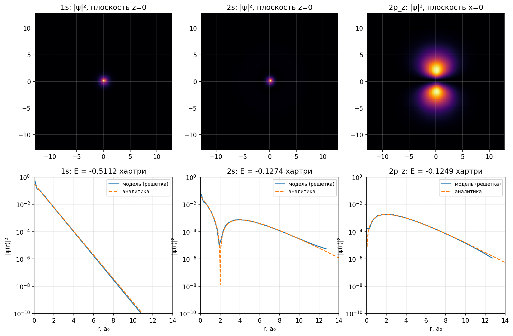

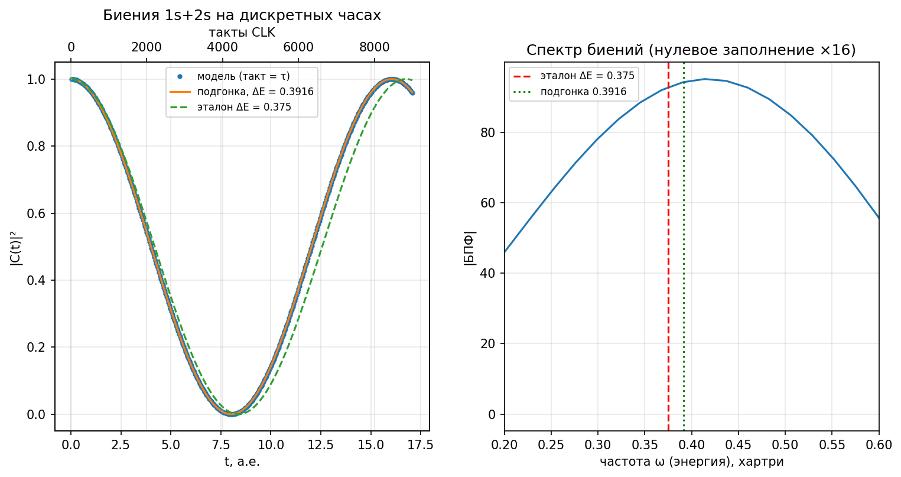

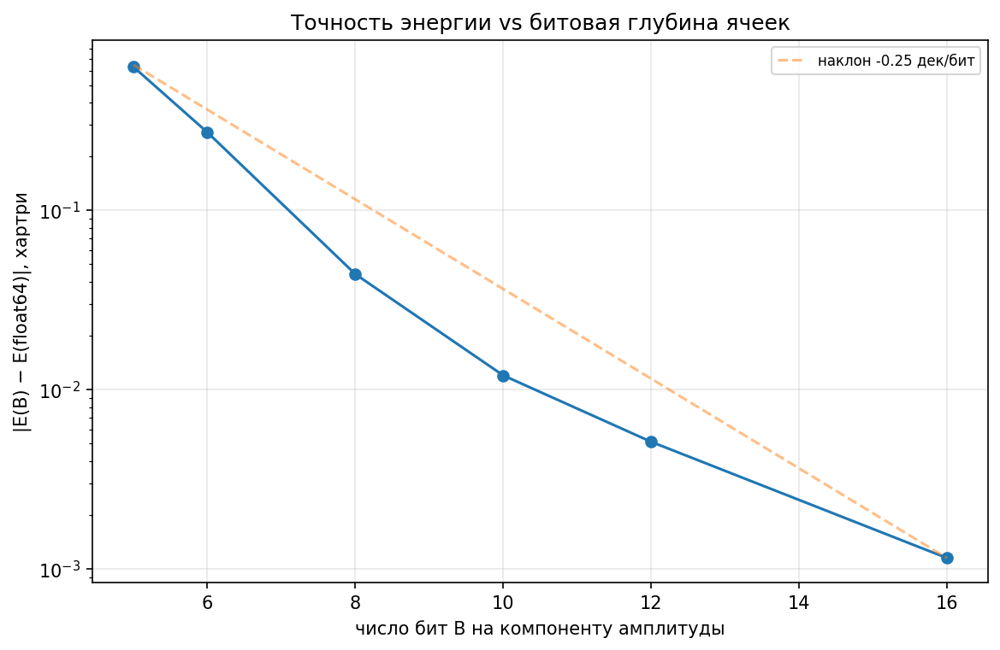

---

## 4. Масса ~ информация: анализ числа 1836

### 4.1 Два сорта информации

Модель различает: **(а) структурную информацию** паттерна-частицы (биты,
определяющие, чем частица *является*: заряд, спин, масса) и **(б) информацию
состояния/поля** (амплитуды ψ и значения полей в ячейках — данные, *порождаемые*
частицей). Гипотеза «масса ~ информация» относится к (а): m_p/m_e = I_p/I_e.
Иначе получается парадокс: волновая функция электрона занимает тысячи ячеек
(см. 4.2) и «весила бы» больше протона.

### 4.2 Численный информационный учёт (из запуска)

* Электрон (1s, B = 12 бит на компоненту): носитель |ψ| > 2⁻¹¹·max — сфера
  радиуса ≈ 7.6 a₀, ≈ 5.7·10⁴ ячеек (a = 0.32 a₀) → ≈ 1.4·10⁶ бит *состояния*
  (при B = 16 носитель растёт до ≈ 1.4·10⁵ ячеек и ≈ 4.6·10⁶ бит).
* Поле протона (точность 0.005 хартри, B_V = 11): |V| > 0.005 до r = 200 a₀ →
  ≈ 1.0·10⁹ ячеек → ≈ 1.1·10¹⁰ бит *поля*. Поле протона информационно
  «тяжелее» электронного состояния на 4 порядка — направление асимметрии масс
  верное, но точное число 1836 требует микроструктуры паттернов (см. 4.3).
* Энергия связи 13.6 эВ = 2.7·10⁻⁵ от mₑc² = 511 кэВ — связывание есть малая
  *поправка* к массам-информациям частиц: массы аддитивны, взаимодействия — нет.

### 4.3 Число 1836

m_p/m_e = **1836.152673…** Факты и наблюдения:

* 1836 = 2²·3³·17; в двоичной записи 11100101100 — без очевидной регулярности.
* 2¹¹ = 2048 = 1836 + 212 (= 4·53) — «почти» 11 бит, но разница 11.5% не мала.
* Знаменитое совпадение Ленца: m_p/m_e ≈ **6π⁵ = 1836.118** — отклонение всего
  0.0019%! Столь точное «случайное» совпадение — либо намёк на структуру
  (фазовый объём 3-мерного гармонического осциллятора даёт степени π), либо
  нумерология. Честно: без микроскопической теории это не более чем наблюдение.
* Геометрия: если протон — «капля» из 1836 ячеек, её радиус (4π/3)R³ = 1836 →
  R ≈ 7.6 ячейки (диаметр ~15); поверхность 4πR² ≈ 724, сечение πR² ≈ 181.
* Если электрон — минимальный паттерн из Nₑ бит, протон содержит 1836·Nₑ бит.
  При Nₑ = 1: m_bit = mₑ = 9.1·10⁻³¹ кг; бит энергии = mₑc² = 511 кэВ.
  Проблема: нейтрино легче электрона (m < 1 эВ) — в строгой версии гипотезы
  нейтрино — «дробные» структуры, либо единица массы много меньше mₑ
  (тогда Nₑ = 1836, а протон = 1836² бит). Фотон (m = 0) естественно
  интерпретируется как чистое возбуждение поля — 0 структурных бит.
* Честный вывод: отношение масс задаёт лишь *отношение* информационных
  содержаний; абсолютные числа бит Nₑ, N_p модель baseline не фиксирует —
  это задача для микроскопической теории паттернов (направление дальнейшей
  работы, раздел 6).

### 4.4 Тактовый учёт (часы CLK)

τ = a/c. При a = 0.26 a₀: τ = 4.6·10⁻²⁰ с. Период обращения (боровская орбита,
n=1): 2π а.е. = 1.52·10⁻¹⁶ с ≈ 3300 тактов. Период биений Lyman-α: 16.76 а.е. =
0.405 фс ≈ 8800 тактов; длина волны 121.6 нм = 8800 ячеек (λ = cT — согласовано).

### 4.5 Нейтрон: как он получается и почему распадается

**Числа.** m_n = 939.5654 МэВ = 1838.6837·mₑ; m_p = 938.2721 МэВ =
1836.1527·mₑ. Нейтрон на 2.531 mₑ (1.293 МэВ) тяжелее протона; свободный
нейтрон распадается n → p + e⁻ + ν̄ₑ с выделением Q = m_n − m_p − m_e =
0.7823 МэВ = 1.531·mₑ и временем жизни ≈ 879 с (период полураспада ≈ 609 с).

**Нейтрон в информационной картине.** По гипотезе «масса ~ информация»
нейтрон — собственный структурный паттерн с I_n = 1838.68 информационных
единиц. Он не является «протон + электрон в одной ячейке» (такая картина
опровергнута ещё соотношением неопределённостей: электрон, запертый в области
размером ядра R ≈ 1 фм, имел бы импульс ħ/R ≈ 200 МэВ/c — на порядки больше
энергии связи). Вместо этого нейтрон — паттерн, связанный с протонным
**переписыванием битов** (слабое взаимодействие): разница информационных
содержаний I_n − I_p = 2.531 единицы — это биты «слабой конфигурации»,
кодирующие готовность к превращению.

**Почему свободный нейтрон распадается.** Превращение n → p + e⁻ + ν̄ₑ —
это «вычисление», которое вычислитель выполняет над паттерном; оно разрешено,
потому что конечное состояние информационно дешевле (легче): ΔI = I_n −
(I_p + I_e + I_ν̄) = 1.531 единицы — положительный «информационный дефицит»,
который и уносится кинетической энергией продуктов. Скорость распада задаётся
правилом Сарджента (для разрешённых β-переходов): Γ ∝ Q⁵ — темп «вычисления»
есть пятая степень доступной разности масс/информаций. Время жизни 879 с при
Q = 0.782 МэВ — эмпирическая калибровка этой степени.

**Почему в ядре нейтрон стабилен.** Внутри ядерного паттерна превращение
n → p меняет не только сам нейтрон, но и энергию всего составного паттерна:
появившийся протон добавляет кулоновское отталкивание ≈ (2Z+1)·e²/R ≈
(2Z+1)·1.44 МэВ/фм · A^(−1/3)·1.2⁻¹ ≈ (2Z+1)·1.2/A^(1/3) МэВ и энергию Ферми
(принцип Паули). Когда эта цена превышает Q = 0.782 МэВ, конечное состояние
тяжелее начального — «вычислению» распада некуда деть энергию, оно запрещено
законом сохранения информации-энергии. Простейший пример — дейтрон:
m_d = 1875.613 МэВ < 2m_p + m_e = 1877.055 МэВ: распад нейтрона внутри
дейтрона потребовал бы +1.44 МэВ — поэтому дейтрон стабилен, хотя свободный
нейтрон распадается. Обратный процесс (β⁺-распад/электронный захват в
протон-избыточных ядрах) — то же правило с обратным знаком.

**Честная оговорка.** Наша модель не содержит слабого взаимодействия и ядерных
сил: приведённый анализ — на уровне энергетического баланса и гипотезы
масса~информация. Полная «прошивка» паттернов (правило 3, раздел 3.7) —
направление дальнейшей работы.

---

## 5. Поля: побочный эффект или необходимость?

Тезисы (подкреплённые расчётами):

1. **Поля необходимы — без них нет связанных состояний.** Спектр свободной
   решётки — только зона [0, 6/a²], минимум энергии = 0; кулоновское поле
   создаёт дискретные уровни E < 0 (таблица 3). Без данных-поля электрон
   «не знает» о протоне: по постулату локальности (П2) взаимодействие удалённых
   паттернов возможно только через состояние промежуточных ячеек — это и есть
   определение поля.
2. **Поле — не «побочный эффект», а механизм взаимодействия.** В модели поле —
   буквально данные в ячейках, записываемые источником по локальному правилу
   (релаксация Пуассона, рис. m7). Статический закон 1/r — неподвижная точка
   этого правила; динамика поля (излучение) распространяется со скоростью
   ≤ 1 ячейки/такт = c.
3. **Ближняя зона поля нетривиальна.** G(0) = 2πW/a, вдоль осей G > 1/r,
   кубическая анизотропия O(a²/r²) (рис. m1). Энергии слабо чувствительны к
   деталям ближнего поля: замена точного G на 1/r (при сохранении узла G(0))
   меняет E₁ₛ на ≈ 1% при a = 0.25 и 0.7% при a = 0.2 (таблица 3) —
   самосогласованная проверка того, что 1/r — правильный дальнодействующий
   предел.
4. **Электромагнетизм как поток полевых битов.** В рамках модели фотон —
   возбуждение поля (0 структурных бит, масса 0); статическое кулоновское поле —
   установившийся поток/состояние полевых данных. (Количественная динамическая
   КЭД-версия — за рамками этого отчёта, честно указано в разделе 6.)

### 5.2 Гравитация: вписывается ли она в модель

**Прямой ответ.** В текущей реализации — нет: решётка фиксирована, динамика
нерелятивистская, гравитация отсутствует. Но архитектура модели (биты,
локальные правила, CLK, масса ~ информация) — это в точности тот язык, на
котором гравитация *выводится* из информации; модель даёт три конкретных входа.

**Вход 1: термодинамика вычислений.** Вычислитель конечен, а значит, у него
есть термодинамика: стирание бита стоит k_B·T·ln 2 (Ландауэр), скорость
обработки ограничена энергией: dI/dt ≤ 2E/πħ (граница Марголуса–Левитина) —
темп тактов CLK ограничен полной энергией-массой мира. Якобсон (1995) показал,
что уравнения Эйнштейна выводятся из трёх вещей: dQ = T dS (Клаузиус),
температура Унру T = ħa/(2πc·k_B) и энтропия горизонта S = k_B·A/(4l_P²);
Верлинде переформулировал гравитацию как энтропийную силу. Всё это — чистые
утверждения об информации и её обработке: гравитация в вычислительной картине
есть *термодинамика самого вычислителя*, а не отдельное поле.

**Вход 2: динамика решётки (дискретное пространство-время).** Наша пара
(решётка, CLK) — это в точности дискретное пространство-время подходов к
квантовой гравитации: исчисление Редже (кривизна = дефицит углов в дефектах
решётки) и причинные динамические триангуляции. Обобщение модели очевидно по
форме: масса (структурные биты) порождает дефекты/деформации решётки, кривизна =
локальное изменение связности, а замедление локального темпа тактов =
гравитационное замедление времени. Постулат глобального CLK при этом
обобщается до локального темпа тактов, зависящего от плотности информации —
это и есть метрика.

**Вход 3: масса ~ информация ⇒ гравитация универсальна.** В модели
гравитационный заряд — это полная структурная информация паттерна (масса), в
отличие от электромагнетизма, который «видит» только биты заряда. Отсюда сразу
следует универсальность тяготения (всё, что имеет биты, гравитирует) —
эквивалентность инертной и гравитационной массы в информационном языке
тривиальна: это одно и то же число битов. Протон (1836 единиц) и электрон
(1 единица) гравитируют пропорционально информации. Честно: слабость гравитации
(G_N·m_p²/ħc ≈ 5.9·10⁻³⁹ против e²/ħc ≈ 1/137) — иерархия констант, которую
модель пока не объясняет.

**Чёрные дыры и предел плотности информации.** Решётка даёт конечную плотность
информации B/a³; при a ~ l_P это в точности предел Бекенштейна–Хокинга
S = k_B·A/(4l_P²) — один бит на ~4 планковских площадки. Чёрная дыра в этой
картине — максимально плотный паттерн решётки (насыщение предела). Наша
регуляризация кулоновского узла G(0) = 2πW/a — пример того, как решётка
естественно обрезает ультрафиолетовые расходимости, — тот же механизм, что
планковское обрезание в гравитации.

**Принцип эквивалентности как ограничение на «прошивку».** Локально правила
вычислителя должны быть неотличимы в свободно падающей и в ускоренной системе —
это сильное ограничение на будущую динамику решётки (аналог требования
локальной лоренц-инвариантности правила).

**Итог.** Гравитация не реализована, но модель и гравитация совместимы по
конструкции: это единственная сила, которая в информационной картине
оказывается не «ещё одним полем», а термодинамикой/геометрией самого
вычислительного субстрата. Дискретная динамика гравитации (уравнения Редже +
источники-паттерны) — конкретное направление дальнейшей работы.

---

## 6. Честный разбор: ограничения и открытые вопросы

1. **Почему правило именно такое?** П3 (дискретное уравнение Шрёдингера)
   подобрано так, чтобы воспроизводить эталон. Вычислительная модель объясняет
   *размерность 3+1* и *роль полей* из своих постулатов, но само линейное
   унитарное правило пока постулируется. Кандидаты на вывод: (а) требование
   сохранения информации (унитарность) + линейность как первый член разложения;
   (б) принцип наименьшего действия в дискретной форме. Открытый вопрос.
2. **Спин, фермионы, Паули.** Baseline — бесспиновая одночастичная модель.
   Спин-½ в вычислительной Вселенной должен быть свойством паттерна
   (квантовая прогулка/«шахматная доска» Фейнмана — естественный кандидат:
   спин возникает из двухшаговой структуры правила). Не реализовано.
3. **Релятивизм.** Нерелятивистский предел; тонкая структура (α² ≈ 5·10⁻⁵)
   и лэмбовский сдвиг не воспроизводятся. В дискретной модели релятивистский
   аналог — уравнение Дирака на решётке (фермионное удвоение — известная
   трудность, связанная с топологией решётки!).
4. **Измерение и декогеренция.** Модель детерминирована и унитарна; механизм
   «коллапса»/ветвления не введён. В вычислительной парадигме естественно
   ожидать, что измерение — это взаимодействие с макроскопическим числом битов
   окружения (декогеренция), но количественной реализации нет.
5. **Масштабы.** Если a = l_P (планковская длина 1.6·10⁻³⁵ м), то a₀/a ≈ 3.3·10²⁴:
   один атом занимает ~10⁷³ ячеек; «Вселенский вычислитель» обязан обрабатывать
   астрономическое число бит за такт τ_P = 5.4·10⁻⁴⁴ с. Наши расчёты используют
   a ~ 0.2 a₀ как эффективное (крупнозернистое) описание — в 10²⁴ раз грубее.
   Утверждение о выполнимости такого вычисления в реальном мире — за рамками
   физики, это метафизика гипотезы; честно фиксируем.
6. **Число 1836.** Гипотеза «масса ~ информация» согласована (отношение масс =
   отношение информации), но структура паттернов (почему именно 1836 бит)
   не выведена. Совпадение 6π⁵ заслуживает отдельного исследования.
7. **Что модель реально объяснила?** (а) почему пространство 3-мерно (закон 1/r);
   (б) почему поля необходимы и что они такое (данные + локальные правила);
   (в) как дискретный мир с конечной битовой глубиной воспроизводит квантовую
   механику с контролируемой ошибкой O(a²) и экспоненциальной точностью по
   числу бит; (г) часы: период биений выражается в целых тактах CLK.

---

## 7. Численные результаты (таблицы из запусков)

### Таблица 1. Средние значения (аналитика, а.е.; проверено численно)

| (n,l) | ⟨r⟩ | ⟨r²⟩ | ⟨1/r⟩ | ⟨p²⟩ | ⟨T⟩ | ⟨V⟩ |
|---|---|---|---|---|---|---|
| 1s | 1.5 | 3 | 1 | 1 | 0.5 | −1 |
| 2s | 6 | 42 | 0.25 | 0.25 | 0.125 | −0.25 |
| 2p | 5 | 30 | 0.25 | 0.25 | 0.125 | −0.25 |

### Таблица 2. Радиальная диагонализация (h = 0.05, R = 60 a₀)

| состояние | E_числ, хартри | E_точн | ошибка |
|---|---|---|---|
| 1s | −0.499688 | −0.5 | −3.1·10⁻⁴ |
| 2s | −0.124980 | −0.125 | −2.0·10⁻⁵ |
| 2p | −0.125007 | −0.125 | +6.5·10⁻⁶ |
| 3d | −0.055556 | −0.055556 | −8·10⁻⁸ |

Сходимость по шагу сетки: ошибка E₁ₛ ∝ h^1.89 ≈ O(h²) (рис. b3).

### Таблица 3. Спектр вычислительной модели (поле решётки G, точные s-оболочки)

| a, a₀ | E₁ₛ | E₂ₛ | E₃ₛ | ошибка E₁ₛ | ошибка E₂ₛ |
|---|---|---|---|---|---|
| 1.0 | −0.9519 | −0.1889 | −0.0738 | −0.4519 | −0.0639 |
| 0.5 | −0.6213 | −0.1416 | −0.0605 | −0.1213 | −0.0166 |
| 0.25 | −0.5238 | −0.1283 | −0.0566 | −0.0238 | −0.0033 |
| 0.2 | −0.5147 | −0.1270 | −0.0562 | −0.0147 | −0.0020 |
| эталон | −0.5 | −0.125 | −0.0556 | — | — |

Наклон сходимости E₁ₛ: 2.15 (≈ O(a²)). При a = 1.0 связаны 4 состояния; при
a→0 число связанных состояний растёт (в пределе — бесконечная кулоновская
серия). Влияние ближнего поля (точное G против 1/r при том же узле
G(0)/a) на E₁ₛ: −0.0188 (a=0.5), −0.0053 (a=0.25), −0.0035 (a=0.2) — затухает
как O(a²), т.е. 1/r — корректный дальнодействующий предел поля решётки.

### Таблица 4. 3D-модель (мнимое время, a = 0.2, 128³)

| состояние | E_модель | E_эталон | ошибка |
|---|---|---|---|
| 1s | −0.5112 | −0.5 | −0.0112 |
| 2s | −0.1274 | −0.125 | −0.0024 |
| 2p_z | −0.1249 | −0.125 | +0.0001 |

Перекрёстная проверка 3D ↔ точные оболочки: |ΔE₁ₛ| = 1.8·10⁻⁴ (a=1.0) и
1.1·10⁻⁴ (a=0.2).

### Таблица 5. Битовая глубина (a = 0.32, 64³; E_ref(float64) = −0.5333)

| B, бит | E(B) | ошибка vs float64 |
|---|---|---|
| 5 | +0.0978 | +0.631 |
| 6 | −0.2611 | +0.272 |
| 8 | −0.4892 | +4.4·10⁻² |
| 10 | −0.5213 | +1.2·10⁻² |
| 12 | −0.5282 | +5.1·10⁻³ |
| 16 | −0.5321 | +1.2·10⁻³ |

Ошибка убывает экспоненциально: по точкам B ≥ 8 наклон −0.20 дек/бит
(≈ 2^(−0.66·B)); для точности 10⁻³ хартри нужна глубина B ≈ 16 бит на
компоненту амплитуды (экстраполяция). При B ≤ 6 квантизация разрушает
состояние (энергия положительна при B = 5).

### Таблица 6. Биения и часы (a = 0.26, 96³, такт τ = a/c = 4.59·10⁻²⁰ с)

| величина | значение |
|---|---|
| E₁ₛ модели | −0.5204 |
| E₂ₛ модели | −0.1288 |
| ΔE = E₂ₛ−E₁ₛ (собственные значения) | 0.3916 (эталон 0.375, т.е. +4.4%) |
| ΔE из подгонки биений | 0.3916 |
| период биений | 8457 тактов CLK = 0.388 фс |
| период обращения (n=1) | ≈ 3300 тактов |
| λ(Lyman-α) = c·T | 121.6 нм ≈ 8830 ячеек |

Частота биений вычислительной модели совпадает с её собственным спектром
(подгонка vs собственные значения: 5·10⁻⁵), а от эталона отличается ровно на
ошибку дискретизации спектра при a = 0.26.

---

## 8. Выводы (тезисы)

1. Построен и проверен эталон: аналитическая + численная квантовая модель
   водорода (Eₙ = −13.6057/n² эВ, Rₙₗ, Yₗₘ, φ(p), биения Lyman-α).
2. Построена вычислительная модель: 3+1-мерная решётка ячеек (B бит), глобальный
   CLK (τ = a/c), локальные правила; размерность 3 выведена из требования
   закона 1/r (функция Грина дискретного лапласиана).
3. Модель воспроизводит эталон: спектр сходится к Eₙ с ошибкой O(a²); профили
   плотностей совпадают (импульсные — в пределах ошибки дискретизации, раздел 2.6);
   биения на дискретных часах дают ΔE, совпадающий с собственным спектром модели
   (5·10⁻⁵) и отличающийся от эталона на ошибку дискретизации (+4.4% при a = 0.26);
   точность экспоненциальна по числу бит ячеек.
4. Поля — не побочный эффект: без них нет связанных состояний; поле — данные
   ячеек, порождаемые локальным правилом (неподвижная точка = 1/r).
5. Гипотеза «масса ~ информация» согласована с 1836 как отношением структурной
   информации; найден любопытный факт m_p/m_e ≈ 6π⁵ (отклонение 0.0019%);
   абсолютная структура паттернов — открытая задача.
6. Честные ограничения: правило динамики постулировано; спин, релятивизм,
   измерение — открытые вопросы; масштаб «Вселенского вычислителя» —
   метафизический.

---

## 9. Практическая применимость (молекулярная динамика и квантовые вычисления)

**Прямой ответ.** Реализованная модель — исследовательский прототип одного
электрона во внешнем поле; как «движок» молекулярной динамики она не годится:
в ней нет многочастичности, антисимметрии (Паули), тяжёлых атомов и ускорения.
Однако её **вычислительное ядро совпадает с рабочим аппаратом современных
методов** — это и есть практическая ценность.

**1. Решёточные методы DFT/TDDFT (то, чем реально считают молекулы).**
Программы Octopus, GPAW, BigDFT решают уравнение Шрёдингера/Кона–Шэма именно
на 3D-сетках с конечными разностями: наш дискретный лапласиан L_d — их
стандартный трафарет, наше расщепление Троттера — их стандартный пропагатор,
наша регуляризация узла G(0)/a — частный случай псевдопотенциала. Наша
сетка a = 0.2 a₀, N = 128 (2·10⁶ ячеек, ~30 МБ в complex64) — типичный
маленький расчёт такого кода. Оценка масштабирования: атом водорода требует
объёма ~ (10 a₀)³ при a = 0.1 a₀ → ~10⁶ ячеек; молекула из Nₐ атомов в
нанобоксе (30 Å)³ → ~10⁹ ячеек ≈ 16 ГБ — на границе возможностей GPU, и именно
поэтому практика добавляет псевдопотенциалы, адаптивные сетки и DFT-редукцию.
Главный честный барьер — многоэлектронная антисимметрия: волновая функция
N электронов живёт не в нашем «поле амплитуд», а в пространстве детерминантов
Слэтера (экспоненциальный рост); практические методы обходят это через DFT
(функционал плотности). Наша модель — одночастичный предел этой схемы.

**2. Квантовые вычисления.** Модель отображается на квантовую схему почти
один-в-один: ячейка = регистр кубитов (B-битная fixed-point амплитуда —
в точности конечная точность квантового регистра), кинетический шаг =
квантовое преобразование Фурье, потенциал = диагональные фазовые вентили.
Симуляция атома водорода на решётке — одна из эталонных задач квантовой
симуляции (Aspuru-Guzik et al., 2005). Наше исследование битовой глубины —
это анализ конечной точности таких схем: ошибка энергии ~ 2^(−0.66B), для
точности 10⁻³ нужно B ≈ 16 бит на компоненту (раздел 7, таблица 5).

**3. Решёточные методы физики частиц/ядер.** Точные s-оболочки (раздел 3.8),
структура функции Грина, фермионное удвоение — тот же математический аппарат,
что в решёточной КХД (оператор Вильсона–Дирака).

**Вывод.** На вопрос «можно ли использовать модель практически» — да, в
следующем смысле: каждый её элемент (решётка, fixed-point амплитуды, трафарет,
расщепление, регуляризация узла) — рабочий инструмент квантовой химии и
квантовых вычислений; для практической молекулярной динамики к ядру нужно
добавить многочастичность (DFT/детерминанты), псевдопотенциалы и GPU —
стандартные надстройки, не меняющие саму модель. Сама же гипотеза
«вычислительной Вселенной» от практической применимости не зависит.

---

## Приложение А. Структура репозитория

```
Readme.md                  — задание
src/units.py               — константы (CODATA), атомные единицы
src/hydrogen_exact.py      — аналитика: E_n, R_nl, Y_lm, φ(p), средние
src/radial.py              — радиальная диагонализация (общая для обеих моделей)
src/lattice.py             — решётка: лапласиан, функция Грина, точные s-оболочки,
                             мнимое время, расщепление, квантизация битов
src/checkerboard.py        — правило материи (шахматная доска Фейнмана)
src/plotting.py            — помощники matplotlib
scripts/run_baseline.py    — эталон: аналитика + численные проверки + рисунки
scripts/run_model.py       — вычислительная модель: все эксперименты + рисунки
scripts/run_extensions.py  — расширение: правило материи, нейтрино, структуры,
                             нуклеосинтез дейтерия, анимация протона
results/baseline/*.png,json, results/model/*.png,json, results/extensions/*
report/REPORT.md           — этот отчёт
report/REPORT_EXTENSION.md — отчёт №2: расширение исследования
report/GLOSSARY.md         — словарь понятий с анимациями (визуальный гид)
```

Запуск: `python scripts/run_baseline.py`; `python scripts/run_model.py`
(3D-расчёты занимают несколько минут). Проверки `PASS/FAIL` печатаются в лог и
сохраняются в `report.json`.
